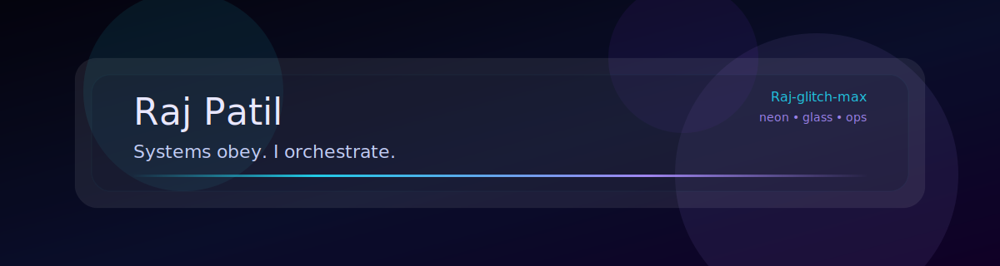

<!-- Raj-glitch-max | Profile README (Neon Glassmorphism DevOps) -->

  

<h1 align="center">Raj Patil</h1>

  <b>Systems obey. I orchestrate.</b>

  DevOps • Cloud • SRE • Platform Engineering

  
  &nbsp;
  
  &nbsp;
  

  
  &nbsp;
  

## Operating mode
- Building platforms that ship fast, rollback clean, and survive real traffic.
- Automating infra and releases with repeatability, guardrails, and observability.
- Treating outages like boss fights: detect, contain, recover, and write the postmortem.

## Loadout

  
  
  
  
  
  
  
  

## DevOps meme (text-only, always true)
- Developer: "It works on my machine."
- DevOps: "Cool. Ship your machine."

## Stats arcade

  
  &nbsp;
  

## Command palette
