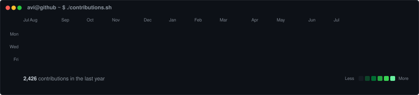

<h1 align="center">Raj Patil</h1>

<p align="center">
  DevOps Engineer &nbsp;·&nbsp; Open Source &nbsp;·&nbsp; AWS &nbsp;·&nbsp; Kubernetes &nbsp;·&nbsp; Terraform
</p>

<p align="center">
  <a href="https://www.linkedin.com/in/raj-patil-311b6b259/">
    
  </a>
  &nbsp;
  <a href="mailto:rpdinkar92260@gmail.com">
    
  </a>
  &nbsp;
  
</p>

---

<div align="center">

<h3><code>avi@github ~ $ whoami</code></h3>
<table>
  <tr>
    <td valign="top"></td>
    <td valign="top"></td>
  </tr>
</table>

<br><br>

<h3><code>avi@github ~ $ ./contributions.sh</code></h3>


</div>

---


## What I build

I find real gaps in DevOps tooling and ship focused, composable CLI tools that solve one thing precisely.

---

## Projects

### [tf-why](https://github.com/Raj-glitch-max/tf.why) &nbsp;·&nbsp; `pip install tf-why`

> Terraform tells you something drifted. **tf-why tells you who did it.**

```bash
terraform show -json plan.tfplan | tf-why
```

```
aws_security_group.web  (ingress rules changed)
├── Changed by:   john.doe@company.com
├── When:         2 days ago
├── Via:          AWS Console
└── Event:        AuthorizeSecurityGroupIngress
```

Reads Terraform plan JSON → queries AWS CloudTrail → outputs the exact actor, timestamp, and method.
No database. No dashboard. No agents. 25+ AWS resource types.

---

### [kubernetes-llm-incident-response-benchmark](https://github.com/Raj-glitch-max/kubernetes-llm-incident-response-benchmark)

> Benchmarking LLMs on real Kubernetes incident diagnosis.

Injects real failure scenarios into a live cluster and measures how accurately LLMs diagnose, explain, and suggest remediation — structured, repeatable, and scored.

---

### [AI-DRIVEN-self-healing-CICD](https://github.com/Raj-glitch-max/AI-DRIVEN-self-healing-CICD)

> A CI/CD pipeline that detects and heals its own failures.

GitHub Actions + LLM pipeline that monitors build failures, classifies root cause, and automatically applies or suggests fixes — closing the loop between failure detection and remediation.

---

## Stack

<p>
  
  
  
  
  
  
  
</p>

---

<p align="center">
  
  &nbsp;
  
</p>
